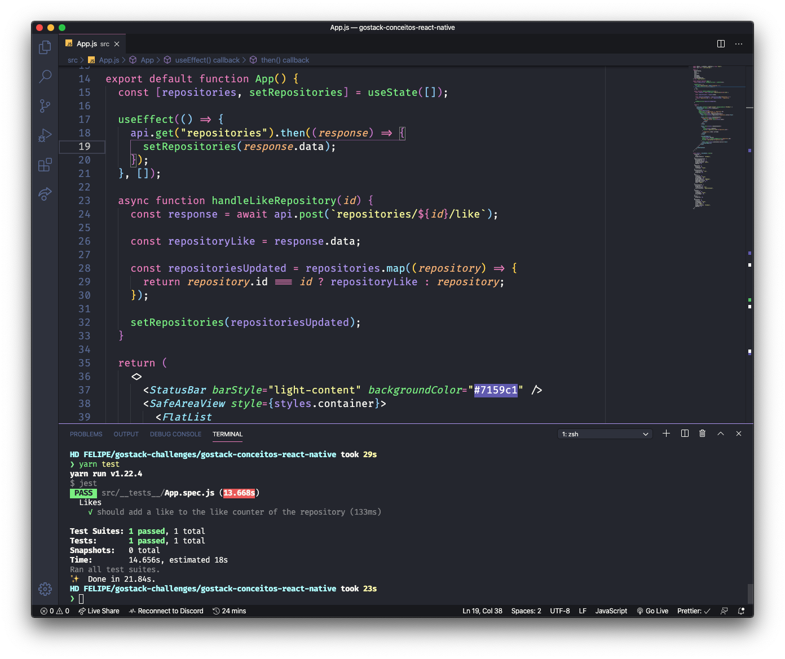
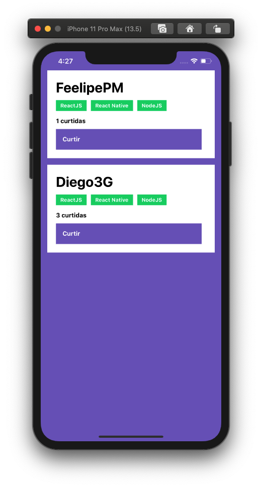
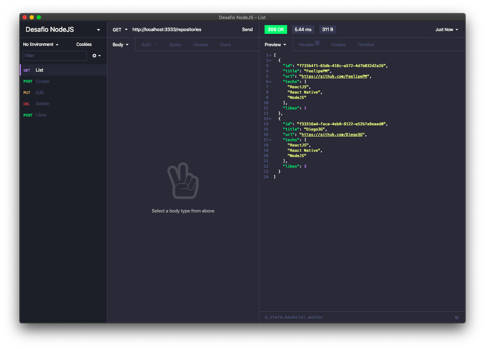

<h3 align="center">
  Desafio: Conceitos do React Native
</h3>

“Aprendizado é um processo e você não vai ser um expert em uma semana.” by Diego Fernandes</blockquote>

  <a href="#rocket-sobre-o-desafio">Sobre o desafio</a>&nbsp;&nbsp;&nbsp;|&nbsp;&nbsp;&nbsp;
  <a href="#preview">Preview</a>&nbsp;&nbsp;&nbsp;|&nbsp;&nbsp;&nbsp;
  <a href="#licença">Licença</a>

## Sobre o desafio

A idéia do desafio é criar uma aplicação para treinar o que foi aprendido até agora com React Native!

A aplicação irá armazenar repositórios do seu portfólio, que foi desenvolvido no backend utilizando o [Node.js](https://github.com/FeelipePM/gostack-conceitos-nodejs), e no último desafio em [ReactJS](https://github.com/FeelipePM/gostack-conceitos-reactjs). e além disso permitir que os repositórios possam receber "likes".

Acesse a pasta criada e abra no Visual Studio Code, lembre-se de executar o comando `yarn` no seu terminal para instalar todas as dependências.

#### Atenção: Caso você esteja emulando no iOS, na pasta do seu projeto navegue até a pasta ios executando o comando cd ios e depois execute pod install para instalar todas as dependências para o iOS.

## Preview

  

  

  

## Licença

Esse projeto está sob a licença MIT. [LICENSE](LICENSE.md)

---

Feito com ❣️ by [Felipe Machado](https://github.com/FeelipePM)
